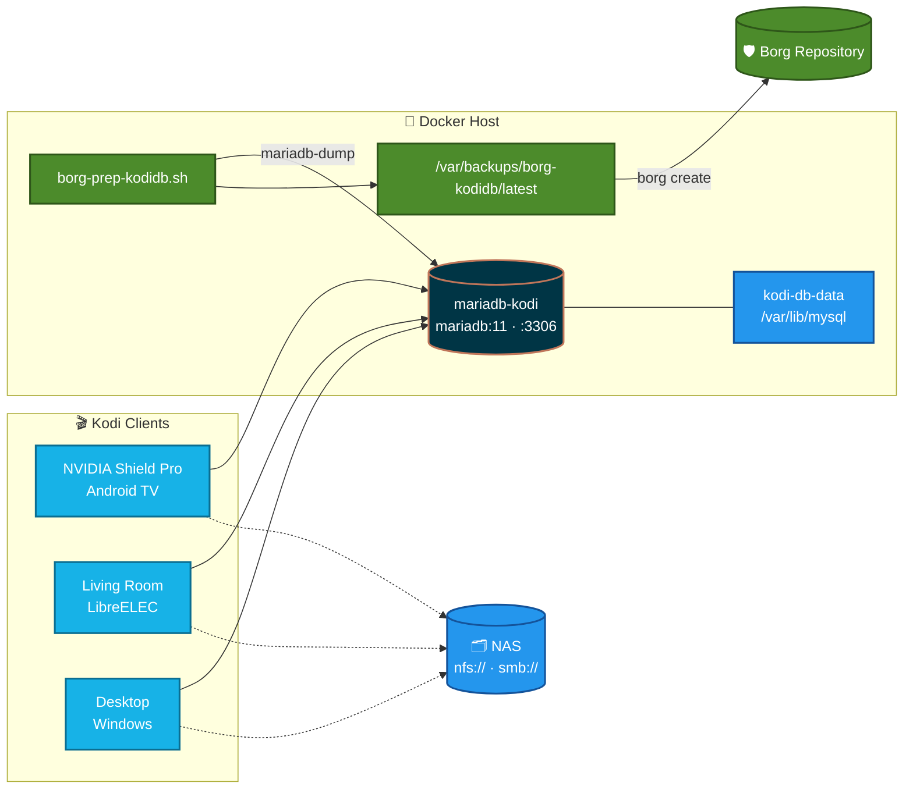

<h1 align="center">Kodi Shared Library — MariaDB Backend</h1>

<p align="center">
  <em>One library. Every device. Watched state that actually stays in sync.</em>
</p>

<p align="center">
  
  
  
  
  
</p>

A Docker Compose stack that runs **MariaDB** as a central database backend for a
shared [Kodi](https://kodi.tv) library. Backups are handled externally by
**Borg**, which calls a pre-backup hook to stage a consistent dump.

Pointing multiple Kodi clients at one database gives you a **single shared library**:
watched status, resume points, and play counts stay in sync across every device,
and you only scrape/maintain metadata once.

---

## Contents

| | Section | |
|---|---|---|
| 🏗️ | [Architecture](#architecture) | How the pieces fit together |
| 📋 | [Requirements](#requirements) | What you need before starting |
| ⚙️ | [Environment Variables](#environment-variables) | Stack configuration |
| 🚀 | [Deploying in Portainer](#deploying-in-portainer) | Getting the stack up |
| 🗄️ | [Database Setup](#database-setup) | The one-time global grant |
| 🎬 | [Kodi Configuration](#kodi-configuration-advancedsettingsxml) | `advancedsettings.xml` |
| 🧭 | [First Run & Client Rollout](#first-run--client-rollout) | **Start here after configuring Kodi** |
| 💾 | [Backups & Restore](#backups--restore) | The Borg hook |
| 🔧 | [Maintenance & Upgrades](#maintenance--upgrades) | Keeping it healthy |
| 🩺 | [Troubleshooting](#troubleshooting) | When something breaks |

---

## Architecture



Solid lines are the **shared metadata** path (MySQL on `:3306`); dotted lines are
**media playback**, which never touches the database.

| Service | Image | Purpose |
|---|---|---|
| `mariadb-kodi` | `mariadb:11` | The database engine Kodi clients connect to. The stack's only service. |

**Storage**

| Volume | Location | Notes |
|---|---|---|
| `kodi-db-data` | Docker host local disk | DB data dir (`/var/lib/mysql`). Local disk is used deliberately — InnoDB over NFS risks corruption. |

**Backups** are out of scope for this stack — see [Backups & Restore](#backups--restore).
Borg runs [`borg-prep-kodidb.sh`](borg-prep-kodidb.sh) on the Docker host before each
run, which stages SQL dumps at `/var/backups/borg-kodidb/latest` for Borg to archive.

---

## Requirements

- A Docker host with **Portainer** installed.
- **Borg** already backing up this host, with the ability to run a pre-backup script.
- Kodi clients on the **same Kodi major version** (the DB schema is tied to it).
- All clients must reference media via **identical network paths** (`nfs://`, `smb://`) —
  not local drive paths — or watched states won't match across devices.

> [!TIP]
> An **NVIDIA Shield Pro** makes a good anchor client: it's typically always on,
> which suits the [designated scanner](#7-designate-a-single-scanner) role. It is
> also the fiddliest client to configure — Android scoped storage makes dropping
> `advancedsettings.xml` into place non-obvious, and Play Store auto-updates can
> bump Kodi's major version behind your back. Both are covered below:
> [Shield Pro setup](#getting-the-file-onto-an-nvidia-shield-pro) and
> [Maintenance](#maintenance--upgrades).

---

## Environment Variables

Set these in Portainer's **Stack → Environment variables** section, or copy
[`.env.example`](.env.example) to `.env` if you deploy with `docker compose` directly.

| Name | | Example | Description |
|---|---|---|---|
| `MARIADB_ROOT_PASSWORD` |  | *strong password* | Root/admin account password. |
| `MARIADB_USER` |  | `kodi` | The DB user Kodi connects as. |
| `MARIADB_PASSWORD` |  | *strong password* | Must match the password in `advancedsettings.xml`. |
| `TZ` |  | `America/New_York` | Timezone (affects log timestamps). |
| `MARIADB_PORT` |  | `3306` | Host port exposed for Kodi clients. |
| `INNODB_BUFFER_POOL_SIZE` |  | `512M` | InnoDB cache size. Raise if RAM allows. |

### Password characters that will break this stack

> [!CAUTION]
> **Use alphanumeric passwords.** The same string passes through three layers
> that each treat punctuation as syntax, and all three fail *silently* — you get
> `Access denied ... (using password: YES)` with nothing to indicate the password
> was mangled rather than simply wrong.

| Character | Where it breaks | What happens |
|---|---|---|
| `$` | Compose / Portainer interpolation | `FW#$Fg2435G` becomes `FW#` — `$Fg2435G` is read as an undefined variable and expands to nothing. The container gets a 3-character password while Kodi sends 11. Escape as `$$` if unavoidable. |
| `#` | `.env` comment parsing | Can truncate the value at the `#`, depending on the parser. |
| `&` `<` `>` | XML | Must be escaped (`&amp;` `&lt;` `&gt;`) in `advancedsettings.xml`, where Kodi reads the same password back. |

Prefer a long `A-Za-z0-9` string — length beats symbol variety here, and none of
these layers can corrupt it.

To check what the container actually received, without printing the secret:

```bash
docker exec mariadb-kodi sh -c 'echo "${#MARIADB_PASSWORD} chars"'
```

If that count doesn't match the password you set, interpolation ate part of it.

> [!IMPORTANT]
> Changing these variables later does **not** change the running database.
> MariaDB reads them only when the `kodi-db-data` volume is first initialized.
> To rotate a password afterwards you must also run `ALTER USER` against the live
> server — see [Rotating the Kodi password](#rotating-the-kodi-password).

The backup script reads the root password from the running container's own
environment, so it needs no credentials of its own. It accepts optional overrides
as environment variables — `KODI_DB_CONTAINER` (default `mariadb-kodi`),
`KODI_BACKUP_BASE` (default `/var/backups/borg-kodidb`), and `MIN_DUMP_BYTES`
(default `1024`).

---

## Deploying in Portainer

1. **In Portainer:**
   - **Stacks → Add stack**, name it `kodi-db`.
   - Paste the contents of [`docker-compose.yml`](docker-compose.yml) into the web editor.
   - Add the [environment variables](#environment-variables) above.
   - **Deploy the stack.**

2. Watch the `mariadb-kodi` logs for `ready for connections`, then continue to
   [Database Setup](#database-setup).

3. Wire up backups — see [Backups & Restore](#backups--restore).

> [!IMPORTANT]
> The stack has no backup service of its own. **Nothing protects this database
> until the Borg hook is installed.**

---

## Database Setup

Kodi manages its **own versioned databases** (`MyVideos131`, `MyMusic83`, …) and
creates/drops them automatically, so the `kodi` user needs **global privileges**
(`*.*`) — not access to a single named database.

The `MARIADB_USER`/`MARIADB_PASSWORD` env vars create the user, but only grant it
rights to one default DB. After the stack's first start, run the global grant once:

> [!WARNING]
> Pick **one** of the two options below — they are not interchangeable. The
> passwords live in the *container's* environment, so whichever shell you use,
> the expansion has to happen inside the container. Writing
> `-p"$MARIADB_ROOT_PASSWORD"` unquoted from the host lets your **host** shell
> expand it to an empty string, and the client stops at an `Enter password:`
> prompt instead of authenticating.

### Option A — from the Docker host

There is a `docker` CLI here, so wrap the client in `docker exec` and single-quote it:

```bash
docker exec -i mariadb-kodi sh -c 'export MYSQL_PWD="$MARIADB_ROOT_PASSWORD"; exec mariadb -uroot' <<'SQL'
GRANT ALL PRIVILEGES ON *.* TO 'kodi'@'%';
FLUSH PRIVILEGES;
SQL
```

Verify the user can connect:

```bash
docker exec -it mariadb-kodi sh -c \
  'MYSQL_PWD="$MARIADB_PASSWORD" mariadb -u"$MARIADB_USER" -e "SELECT 1;"'
```

### Option B — inside the container

Portainer → `mariadb-kodi` → **Console** (`/bin/bash`), or `docker exec -it mariadb-kodi bash`.
There is no `docker` CLI in here, so drop the wrapper — the variables are already in scope:

```bash
export MYSQL_PWD="$MARIADB_ROOT_PASSWORD"
mariadb -uroot <<'SQL'
GRANT ALL PRIVILEGES ON *.* TO 'kodi'@'%';
FLUSH PRIVILEGES;
SQL
```

Verify the user can connect:

```bash
MYSQL_PWD="$MARIADB_PASSWORD" mariadb -u"$MARIADB_USER" -e "SELECT 1;"
```

You do **not** need to manually create any `MyVideos*` / `MyMusic*` databases —
Kodi builds them on first connection from a client.

### Rotating the Kodi password

Needed whenever the stored password and the one in `advancedsettings.xml` have
drifted apart — after a mangled `$`, or because `MARIADB_PASSWORD` was changed in
Portainer and the volume already existed. **Editing the environment variable is
not enough on its own**; it only applies at first initialization.

Inspect the account first — this confirms the user exists and shows which hosts
it can connect from:

```bash
docker exec -i mariadb-kodi sh -c 'export MYSQL_PWD="$MARIADB_ROOT_PASSWORD"; exec mariadb -uroot' <<'SQL'
SELECT user, host, plugin FROM mysql.user WHERE user='kodi';
SHOW GRANTS FOR 'kodi'@'%';
SQL
```

Then set the new password on the live server and re-assert the global grant:

```bash
docker exec -i mariadb-kodi sh -c 'export MYSQL_PWD="$MARIADB_ROOT_PASSWORD"; exec mariadb -uroot' <<'SQL'
ALTER USER 'kodi'@'%' IDENTIFIED BY 'NewAlnumPassword123';
GRANT ALL PRIVILEGES ON *.* TO 'kodi'@'%';
FLUSH PRIVILEGES;
SQL
```

Confirm it works over **TCP**, which is the path Kodi actually uses — a Unix
socket test can pass while remote clients still fail:

```bash
docker exec -it mariadb-kodi sh -c \
  'MYSQL_PWD="$MARIADB_PASSWORD" mariadb -h127.0.0.1 -u"$MARIADB_USER" -e "SELECT 1;"'
```

Finally, update the value in **three** places or they will drift again:

1. The Portainer stack environment variable (so a future volume rebuild matches).
2. `advancedsettings.xml` on **every** client.
3. Fully restart Kodi on each — see [step 1](#1-fully-restart-kodi).

> [!NOTE]
> If root itself is rejected here, `MARIADB_ROOT_PASSWORD` was mangled the same
> way and you cannot authenticate at all. Recovery means restarting the container
> with `--skip-grant-tables` to reset it, or — if the library is disposable —
> deleting the `kodi-db-data` volume and re-initializing with a clean password.

---

## Kodi Configuration (`advancedsettings.xml`)

On **each** Kodi client, edit (or create) `advancedsettings.xml` in the Kodi
`userdata` folder:

| Platform | Path |
|---|---|
| Windows | `%APPDATA%\Kodi\userdata\advancedsettings.xml` |
| Linux | `~/.kodi/userdata/advancedsettings.xml` |
| **NVIDIA Shield Pro** / Android TV | `/sdcard/Android/data/org.xbmc.kodi/files/.kodi/userdata/advancedsettings.xml` |
| LibreELEC / CoreELEC | `/storage/.kodi/userdata/advancedsettings.xml` |
| macOS | `~/Library/Application Support/Kodi/userdata/advancedsettings.xml` |

Contents:

```xml
<advancedsettings>
  <videodatabase>
    <type>mysql</type>
    <host>192.168.1.20</host>   <!-- Docker host IP running MariaDB -->
    <port>3306</port>
    <user>kodi</user>
    <pass>your_kodi_password</pass>
  </videodatabase>

  <musicdatabase>
    <type>mysql</type>
    <host>192.168.1.20</host>
    <port>3306</port>
    <user>kodi</user>
    <pass>your_kodi_password</pass>
  </musicdatabase>

  <videolibrary>
    <importwatchedstate>true</importwatchedstate>
    <importresumepoint>true</importresumepoint>
  </videolibrary>
</advancedsettings>
```

> [!NOTE]
>
> - `<type>mysql</type>` is correct for **both** MySQL and MariaDB — there is no
>   separate `mariadb` type.
> - `<host>` is the **Docker host** IP (the machine running this stack), **not** the NAS.
> - `<user>`/`<pass>` must match `MARIADB_USER`/`MARIADB_PASSWORD`.

### Getting the file onto an NVIDIA Shield Pro

Android's scoped storage hides `Android/data/` from the built-in file manager and
from most SMB/network shares, so you can't simply copy the file across. Two
approaches that do work:

**Option 1 — ADB over the network** (most reliable, no extra apps):

1. On the Shield: **Settings → Device Preferences → About**, click **Build**
   seven times to unlock Developer options.
2. **Settings → Device Preferences → Developer options**, enable
   **Network debugging**. Note the IP it shows.
3. From any machine with `adb` installed:

   ```bash
   adb connect 192.168.1.50:5555          # the Shield's IP
   adb push advancedsettings.xml \
     /sdcard/Android/data/org.xbmc.kodi/files/.kodi/userdata/advancedsettings.xml
   adb disconnect
   ```

   The Shield shows an on-screen prompt to authorise the connection the first
   time — accept it, or the push fails silently on some Shield Experience builds.

**Option 2 — Kodi's own file manager**: install a file manager add-on inside
Kodi, or use **Settings → File manager** to copy the file from a network source
into `special://profile/`. Kodi runs as the owner of its own data directory, so
it can write there when Android's file pickers cannot.

> [!TIP]
> Whichever route you use, write the file **before** the first Kodi launch if you
> can. A Shield that has already built a local library will keep showing it until
> you restart, which makes it easy to think the config didn't apply.

> [!IMPORTANT]
> Writing this file is only step one. Continue to
> [First Run & Client Rollout](#first-run--client-rollout) — the steps there
> decide whether the shared library actually works.

---

## First Run & Client Rollout

Follow these in order. Steps 1–5 are the **first** client only; step 6 rolls out
to the rest.

### 1. Fully restart Kodi

Not "back to the main menu" — the process has to exit. `advancedsettings.xml` is
read once, at startup.

| Platform | How |
|---|---|
| Windows / macOS / Linux | Quit the app entirely, then relaunch |
| **NVIDIA Shield Pro** / Android TV | Settings → Apps → See all apps → Kodi → **Force stop**, then reopen |
| LibreELEC / CoreELEC | `systemctl restart kodi` |

> [!WARNING]
> On the Shield, backing out of Kodi with the Home button does **not** stop it —
> Android keeps it resident and it will not re-read `advancedsettings.xml`.
> **Force stop** is required. (`adb shell am force-stop org.xbmc.kodi` works too
> if you already have network debugging enabled.)

### 2. Confirm it actually connected

> [!WARNING]
> **Kodi fails silently here.** If the connection is refused it falls back to the
> local SQLite library without any warning, so everything looks normal until you
> notice nothing is syncing. Always verify.

Check `kodi.log` for the connection:

| Platform | Log path |
|---|---|
| Windows | `%APPDATA%\Kodi\kodi.log` |
| Linux | `~/.kodi/temp/kodi.log` |
| **NVIDIA Shield Pro** / Android TV | `/sdcard/Android/data/org.xbmc.kodi/files/.kodi/temp/kodi.log` |
| LibreELEC / CoreELEC | `/storage/.kodi/temp/kodi.log` |
| macOS | `~/Library/Logs/kodi.log` |

On the Shield, pull the log the same way you pushed the config:

```bash
adb connect 192.168.1.50:5555
adb pull /sdcard/Android/data/org.xbmc.kodi/files/.kodi/temp/kodi.log
```

What to look for:

```diff
+ Running database version MyVideos131          ← connected to MariaDB
- Unable to open database ... [1045]            ← bad credentials or missing grant
```

A `[1045]` means the credentials or the global grant are wrong — go back to
[Database Setup](#database-setup).

Confirm from the server side too. The databases are created on the first
successful connection, so if these don't exist, no client has connected:

```bash
MYSQL_PWD="$MARIADB_PASSWORD" mariadb -u"$MARIADB_USER" -e "SHOW DATABASES;"
```

### 3. Expect an empty library

Switching to MySQL does **not** migrate your existing local library. Watched
history, resume points, and ratings stay behind in the local SQLite DB, and Kodi
will not read them again.

> [!IMPORTANT]
> If the existing library is worth keeping, do this **before** scanning:
> Settings → Media → Library → **Export library** → *separate files*. That writes
> `.nfo` files alongside your media, which the scan into MySQL then picks up.
> Once you scan without exporting, that history is gone.

### 4. Add sources as network paths — never local paths

The most consequential step. Kodi stores the literal path string in the shared DB,
so every client has to reach the media by the *same* string.

```diff
+ nfs://192.168.1.30/volume1/Movies    ← resolves identically on every client
+ smb://192.168.1.30/Movies
- /mnt/media/Movies                    ← local mount: unreachable from other clients
- D:\Media\Movies                      ← drive letter: same problem
```

A local path added on one client is unreachable from every other client, and
re-adding the same media under a different path creates duplicate entries with
independent watched state.

### 5. Scan the library

Let it run to completion. This client builds the library that everyone else reads.

### 6. Roll out the remaining clients

Each additional client needs **two** files in its `userdata` folder, not one:

| File | Shared via DB? | Action |
|---|---|---|
| `advancedsettings.xml` | No | Copy verbatim from the first client |
| `sources.xml` | **No** — sources are per-client | Copy it too, or re-add sources using byte-identical paths |

Restart each client fully. They should show the complete library immediately,
with no scan required.

> [!CAUTION]
> Keep every client on the **same Kodi major version**. The schema version is
> baked into the DB name (`MyVideos131`), and a newer client will migrate the
> database out from under the older ones — which strands them on a schema that
> no longer exists.

### 7. Designate a single scanner

> [!TIP]
> On every client *except* one, turn off Settings → Media → Library →
> **Update library on startup**. Concurrent scans against one database cause lock
> contention and duplicate entries.

The **NVIDIA Shield Pro** is usually the right choice for the scanner role — it's
mains-powered, always on, and has a wired network connection. Two caveats:

- **Stop it sleeping through the scan.** Settings → Device Preferences → Sleep,
  set to **Never** (or long enough to cover your scheduled update window). A
  sleeping Shield silently skips its library update.
- **Wired Ethernet matters** for the initial scan. Scraping a large library over
  Wi-Fi while hammering MariaDB is where most "scan takes all night" complaints
  come from.

### Expected behaviour that looks like a bug

> [!NOTE]
>
> - **Artwork and thumbnails are cached locally per client.** Only metadata is
>   shared, so each client re-downloads its own fanart. This is normal.
> - **Watched state propagates on library refresh**, not instantly across clients
>   that are already open and sitting on a list view.

---

## Backups & Restore

> [!CAUTION]
> **This stack does not back itself up.** Copying `/var/lib/docker/volumes/` while
> MariaDB is running captures a torn InnoDB data dir — an archive that looks fine
> and restores to a corrupt database.

Borg gets a logical dump instead, staged by a pre-backup hook.

[`borg-prep-kodidb.sh`](borg-prep-kodidb.sh) runs on the Docker host before each
Borg run and:

1. Refuses to continue unless `mariadb-kodi` is running and root can authenticate —
   it never publishes an empty snapshot over a good one.
2. Dumps **each Kodi database to its own file** with `--single-transaction`, plus
   users and grants to `_users-and-grants.sql`. Per-database files matter for
   dedup: `MyVideos*` churns constantly (watched status, resume points) while
   `MyMusic*` barely changes, so Borg only re-stores what actually moved.
3. Verifies every dump ends with mariadb-dump's `Dump completed` marker and clears
   `MIN_DUMP_BYTES`. A truncated dump aborts the run **before** it is published.
4. Writes `metadata/snapshot-info.txt` (server version, image, database list) and
   `sha256sums.txt`.
5. Atomically `mv`s the staging dir into place, so Borg can never read a
   half-written dump no matter when it starts.

> [!TIP]
> Dumps are left **uncompressed on purpose** — a gzipped dump changes wholesale
> every run and defeats deduplication. Let Borg compress (`borg create -C zstd`).

Retention is **Borg's** job now: the script keeps exactly one current snapshot and
your Borg prune policy provides the point-in-time history.

### Installing the hook

1. Copy the script to the Docker host running this stack:

   ```bash
   sudo install -m 0700 -o root -g root \
     borg-prep-kodidb.sh /usr/local/sbin/borg-prep-kodidb.sh
   ```

2. Add `/var/backups/borg-kodidb/latest` to Borg's **backup paths**. Without this
   the dump is produced every night and never archived.

3. Register the pre-backup script in the Borg UI using
   [`BORG_UI-kodidb-prep-dbdump.sh`](BORG_UI-kodidb-prep-dbdump.sh) as the script
   body — edit the target IP to match the Docker host. This mirrors the pattern
   used by `borg-backup/BORG_UI-smiddleware-prep-appdata.sh`.

4. Verify by hand before trusting it:

   ```bash
   sudo /usr/local/sbin/borg-prep-kodidb.sh
   ls -la /var/backups/borg-kodidb/latest/databases/
   ```

> [!NOTE]
> If this host already runs a `borg-prep-appdata-*.sh` script, the two are
> independent — this one uses its own `/var/backups/borg-kodidb` base so neither
> can clobber the other's atomic publish. You can call it from the existing prep
> script instead of registering a second Borg UI entry.

**Manual dump on demand (outside Borg):**

```bash
docker exec mariadb-kodi \
  mariadb-dump -uroot -p"$MARIADB_ROOT_PASSWORD" --all-databases \
  --single-transaction --events | gzip > kodi-manual.sql.gz
```

**Restore from a Borg archive:**

```bash
# Extract the snapshot from whichever archive you want
borg extract ::ARCHIVE var/backups/borg-kodidb/latest

# Restore one database (or loop over the directory for all of them)
docker exec -i mariadb-kodi sh -c 'export MYSQL_PWD="$MARIADB_ROOT_PASSWORD"; exec mariadb -uroot' \
  < var/backups/borg-kodidb/latest/databases/MyVideos131.sql
```

Each file carries its own `CREATE DATABASE IF NOT EXISTS` / `USE` header, so
databases can be restored individually. Replay `_users-and-grants.sql` if the
`kodi` account or its global grant is missing. Check
`metadata/snapshot-info.txt` first — the database name encodes the Kodi schema
version, and restoring into a different Kodi release will not end well.

> [!WARNING]
> Always take a fresh dump **before** a major Kodi upgrade — a bad schema
> migration can wipe watched history.

---

## Maintenance & Upgrades

- **Keep Kodi versions in sync.** The DB name encodes the schema version
  (`MyVideos131` = a specific Kodi release). Mixing Kodi versions against one DB
  causes conflicts — upgrade all clients together.
- **Updating the MariaDB image:** pull the new image and recreate; the
  `kodi-db-data` volume persists your data.
- **Buffer pool:** if the library is large and the host has RAM, raise
  `INNODB_BUFFER_POOL_SIZE` for faster browsing.

> [!CAUTION]
> **Disable Play Store auto-updates for Kodi on the NVIDIA Shield Pro.** This is
> the most likely way a shared library breaks unattended: the Shield updates Kodi
> overnight, the new version migrates the database to a new schema
> (`MyVideos131` → a new `MyVideos1xx`), and every *other* client — still on the old
> release — wakes up pointing at a database that no longer exists. They fall back
> to empty local libraries, and the watched state accumulated since the upgrade
> is split across two schemas.
>
> On the Shield: **Play Store → Kodi → ⋮ / Options → uncheck Auto-update**. Then
> upgrade Kodi deliberately, on every client, in one sitting — and
> [take a dump first](#backups--restore).

---

## Troubleshooting

### 🎬 Kodi clients

| | Symptom | Likely cause / fix |
|---|---|---|
| 🔴 | Kodi shows an empty/local library | `advancedsettings.xml` not loaded — check the path and restart Kodi fully. Confirm in `kodi.log`; Kodi falls back to local SQLite **silently**. See [step 2](#2-confirm-it-actually-connected). |
| 🔴 | Can't connect from a client | Confirm `MARIADB_PORT` is reachable on the Docker host and not blocked by a firewall/VLAN. |
| 🟠 | Media plays on one client, "file not found" on another | A source was added by local path instead of `nfs://`/`smb://`. See [step 4](#4-add-sources-as-network-paths--never-local-paths). |
| 🟠 | Watched state differs per device | Same cause — media added via different source paths. Use identical `nfs://`/`smb://` paths everywhere. |
| 🟠 | Duplicate entries for the same media | The same files were added under two different source paths. |
| 🔵 | Library is empty after switching to MySQL | Expected — local libraries are not migrated. Export to `.nfo` first, then rescan. See [step 3](#3-expect-an-empty-library). |
| 🔵 | `MyVideos*` databases never appear | No client has successfully connected yet. Kodi creates them on first connection. |
| 🔵 | A client sees the library but has no artwork | Expected — the texture cache is local per client and rebuilds itself. |

### 📺 NVIDIA Shield Pro

| | Symptom | Likely cause / fix |
|---|---|---|
| 🔴 | Every other client went empty overnight | Kodi auto-updated on the Shield and migrated the DB to a new schema. See the [Maintenance caution](#maintenance--upgrades) — disable Play Store auto-update and bring all clients to the same version. |
| 🟠 | Config changes don't take effect | Home button doesn't stop Kodi on Android. **Force stop** it — see [step 1](#1-fully-restart-kodi). |
| 🟠 | Can't reach `Android/data/` to place the file | Android scoped storage hides it from file managers and SMB. Use ADB or Kodi's own file manager — see [Shield Pro setup](#getting-the-file-onto-an-nvidia-shield-pro). |
| 🟠 | `adb push` reports success but nothing changes | The on-screen authorisation prompt was never accepted. Reconnect and watch the TV. |
| 🟠 | Scheduled library update never runs | The Shield slept. Settings → Device Preferences → Sleep → **Never**. |

### 🗄️ Database & shell

| | Symptom | Likely cause / fix |
|---|---|---|
| 🔴 | `Access denied for user 'kodi'@'<client-ip>' (using password: YES)` in `kodi.log` | The network is fine — this is authentication only. Both sides have a password; they don't match. Most likely a `$` in the password was eaten by Compose/Portainer interpolation, or the volume was initialized with an older password. Check the length with `echo "${#MARIADB_PASSWORD}"` inside the container, then [rotate it](#rotating-the-kodi-password). See [password characters](#password-characters-that-will-break-this-stack). |
| 🔴 | `Access denied for user 'kodi'` with `using password: NO` | No password reached the server at all — an empty `<pass>` in `advancedsettings.xml`, or an unquoted shell variable that expanded to nothing. |
| 🔴 | Grant applied, but clients still rejected | You verified over the Unix socket; Kodi connects over TCP. Re-test with `-h127.0.0.1` — see [Rotating the Kodi password](#rotating-the-kodi-password). |
| 🟠 | `docker exec` stops at `Enter password:` | The password expanded to nothing because your **host** shell, not the container, evaluated `$MARIADB_PASSWORD`. Single-quote it — see [Option A](#option-a--from-the-docker-host). |
| 🟠 | `bash: docker: command not found` | You're already inside the container (Portainer Console). Drop the `docker exec` wrapper — see [Option B](#option-b--inside-the-container). |
| 🔵 | `io_uring_queue_init() failed with EPERM` / `create_uring failed: falling back to libaio` | **Expected, ignore it.** The host has io_uring disabled (`kernel.io_uring_disabled=2`) as kernel hardening — Ubuntu 24.04+ ships this way, and Docker's seccomp profile blocks the syscalls too. MariaDB falls back to libaio, its previous default, which is entirely adequate for a library this size. Don't relax the sysctl for it. Note `innodb_use_native_aio=OFF` would silence the warning but switches to *simulated* AIO — worse than the libaio you already have. |

### 💾 Backup hook

| | Symptom | Likely cause / fix |
|---|---|---|
| 🔴 | Dumps exist but aren't in Borg archives | `/var/backups/borg-kodidb/latest` was never added to Borg's backup paths. |
| 🔴 | `cannot authenticate as root` | The container's `MARIADB_ROOT_PASSWORD` no longer matches the initialized data dir. The env var only applies on **first** init; changing it later does nothing. |
| 🟠 | `container mariadb-kodi is not running` | The stack is down, or renamed — set `KODI_DB_CONTAINER` if you changed `container_name`. |
| 🟠 | `missing its completion marker` | The dump was truncated — usually the container was stopped mid-run or the host filled up. Check free space on `/var/backups`. |
| 🟠 | `bash\r: no such file or directory` | `borg-prep-kodidb.sh` was checked out with CRLF endings. Ensure [`.gitattributes`](.gitattributes) is present, then `git rm --cached borg-prep-kodidb.sh && git checkout borg-prep-kodidb.sh`. |

<sub>🔴 breaks the shared library · 🟠 causes wrong or inconsistent behaviour · 🔵 expected, not a fault</sub>
