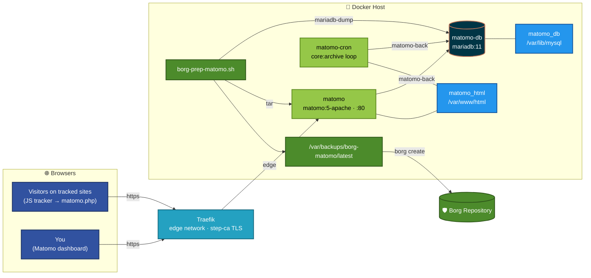

<h1 align="center">Matomo — Self-Hosted Web Analytics</h1>

<p align="center">
  <em>Google Analytics, minus Google. Your visitors' data stays on your hardware.</em>
</p>

<p align="center">
  
  
  
  
  
</p>

A Docker Compose stack that runs [Matomo](https://matomo.org) using the official
[`matomo`](https://hub.docker.com/_/matomo) image, a **MariaDB** backend, and a
**cron sidecar** that pre-builds reports. It is published through the existing
[Traefik](../traefik/) stack with a step-ca certificate, and backed up by **Borg**
through a pre-backup hook.

---

## Contents

| | Section | |
|---|---|---|
| 🏗️ | [Architecture](#architecture) | How the pieces fit together |
| 📋 | [Requirements](#requirements) | What you need before starting |
| ⚙️ | [Environment Variables](#environment-variables) | Stack configuration |
| 🚀 | [Deploying in Portainer](#deploying-in-portainer) | Getting the stack up |
| 🧙 | [Installer Walkthrough](#installer-walkthrough) | The one-time web setup |
| 🔧 | [Post-install Configuration](#post-install-configuration) | **Required** — proxy headers & archiving |
| 📈 | [Tracking a Site](#tracking-a-site) | Adding the JS tracker |
| 💾 | [Backups & Restore](#backups--restore) | The Borg hook |
| ⬆️ | [Upgrades](#upgrades) | Why the image tag isn't the Matomo version |
| 🔒 | [Security](#security) | Who can reach what |
| 🩺 | [Troubleshooting](#troubleshooting) | When something breaks |

---

## Architecture



| Service | Image | Networks | Purpose |
|---|---|---|---|
| `matomo` | `matomo:5-apache` | `edge`, `matomo-back` | Web UI, reporting API, and the tracking endpoint (`matomo.php` / `matomo.js`). |
| `matomo-cron` | `matomo:5-apache` | `matomo-back` | Runs `console core:archive` every `ARCHIVE_INTERVAL` seconds so reports are pre-aggregated. |
| `matomo-db` | `mariadb:11` | `matomo-back` | Stores raw visit logs and archived reports. No published port. |

**Storage**

| Volume | Mount | Notes |
|---|---|---|
| `matomo_html` | `/var/www/html` | The whole Matomo install: code, `config/config.ini.php`, plugins, `tmp/`. Shared by `matomo` and `matomo-cron`. |
| `matomo_db` | `/var/lib/mysql` | MariaDB data dir. Local disk on purpose — InnoDB over NFS risks corruption. |

`matomo-back` is `internal: true`: the DB and the archiver have no route off the host.
Only `matomo` sits on `edge`, and it publishes no host ports — all ingress is via Traefik.

---

## Requirements

- A Docker host with **Portainer**, already running the [traefik](../traefik/) stack
  (which creates the external `edge` network and the `stepca` cert resolver).
- A DNS record for `<MATOMO_HOST>.<BASE_DOMAIN>` (e.g. `matomo.shome`) pointing at Traefik.
  With AdGuard handling `*.shome` rewrites this is usually already covered.
- **Borg** backing up this host, with the ability to run a pre-backup script.
- Browsers that load the tracker must **trust the step-ca root**, or the tracker
  request fails TLS and the visit is silently lost. Fine on managed LAN devices;
  not workable for public visitors — see [Security](#security).

Matomo 5 needs PHP 8+ and MySQL 5.5+/MariaDB; the image and `mariadb:11` cover both.

---

## Environment Variables

Copy [`.env.example`](.env.example) to `.env` (or paste into Portainer's
**Environment variables**) and change every password.

| Variable | Default | Purpose |
|---|---|---|
| `BASE_DOMAIN` | `shome` | Must match the traefik stack. |
| `CERTRESOLVER` | `stepca` | Must match the traefik stack. |
| `MATOMO_HOST` | `matomo` | Subdomain: `matomo.shome`. Must not collide with `traefik/dynamic/20-routers.yml`. |
| `MATOMO_ALLOWLIST` | `192.168.200.0/24,192.168.0.0/16` | CIDRs allowed to reach Matomo **including the tracker**. |
| `MARIADB_ROOT_PASSWORD` | — | MariaDB root. Used by the backup hook. **Alphanumeric only.** |
| `MARIADB_DATABASE` | `matomo` | Database name. |
| `MARIADB_USER` | `matomo` | App DB user. |
| `MARIADB_PASSWORD` | — | App DB password. **Alphanumeric only.** |
| `TZ` | `America/New_York` | Container timezone. |
| `PHP_MEMORY_LIMIT` | `512M` | PHP memory for web and archiver. Keep under the 1g container limit. |
| `ARCHIVE_INTERVAL` | `3600` | Seconds between archiver runs. |
| `INNODB_BUFFER_POOL_SIZE` | `512M` | MariaDB cache size. |

> [!WARNING]
> MariaDB reads the `MARIADB_*` values **only when `matomo_db` is first initialized**,
> and Matomo reads `MATOMO_DATABASE_*` **only during the installer** (afterwards the
> password lives in `config.ini.php`). Changing `.env` later rotates nothing. To rotate
> the app password: `ALTER USER 'matomo'@'%' IDENTIFIED BY '...'` in `matomo-db`, then
> `docker exec -u www-data matomo php console config:set --section=database --key=password --value='...'`.

---

## Deploying in Portainer

1. **Stacks → Add stack**, name it `matomo`.
2. Paste [`docker-compose.yml`](docker-compose.yml) (or point Portainer at this repo,
   compose path `Matomo/docker-compose.yml`).
3. Fill in the environment variables from `.env.example`.
4. **Deploy the stack.** Expect this start-up order:
   - `matomo-db` initializes the database (first run: ~30 s) and goes healthy.
   - `matomo` copies the app into `matomo_html`, starts Apache, and goes healthy.
   - `matomo-cron` starts and logs `core:archive` errors every cycle **until the
     installer is completed** — that is expected and harmless.
5. Browse to `https://matomo.shome/` and continue with the installer.

---

## Installer Walkthrough

| Step | What to do |
|---|---|
| System Check | Should be all green. |
| Database Setup | Pre-filled from the env vars (the password shows as `**********`). Confirm **host** `matomo-db`, **prefix** `matomo_`, adapter `PDO\MYSQL`, and change **Database engine** from *MySQL* to **MariaDB**. |
| Creating the Tables | Automatic. |
| Superuser | Create your admin login. Use a password manager — this is the only auth in front of the dashboard. |
| Set up a Website | Your first tracked site (more can be added later). |
| Tracking Code | Copy it, or grab it later from **Administration → Websites → Tracking Code**. |
| Congratulations | Leave **GeoIP2 geolocation** and **IP anonymisation** ticked. GeoIP downloads a ~130 MB city database; anonymisation masks the last two bytes of each IP. |

The installer writes `matomo.shome` into `trusted_hosts` automatically because that is
the hostname you used. Don't add other names there unless you actually browse to
Matomo by them. Matomo saves the host of each request as its own URL, and that URL
is what the tracking-code snippet uses.

---

## Post-install Configuration

> [!IMPORTANT]
> Do this right after the installer. Until you do, **every visit is recorded with
> Traefik's container IP**, so geolocation and unique-visitor counts are wrong.

Run these from the Docker host (or Portainer → `matomo` → **Console**, user `www-data`,
dropping the `docker exec ...` prefix):

```bash
# Behind Traefik: read the real client IP and host from the forwarded headers,
# and treat every request as https — Traefik terminates TLS and talks to Matomo
# over plain http. With assume_secure_protocol set, force_ssl causes no redirect
# loop; it just stops Matomo's System Check recommending it.
docker exec -u www-data matomo php console config:set \
  'General.proxy_client_headers[]="HTTP_X_FORWARDED_FOR"' \
  'General.proxy_host_headers[]="HTTP_X_FORWARDED_HOST"' \
  'General.assume_secure_protocol=1' \
  'General.force_ssl=1'

# Reports are built by matomo-cron, so stop building them on dashboard page loads
# (slow, and can time out on larger date ranges).
docker exec -u www-data matomo php console config:set \
  'General.enable_browser_archiving_triggering=0' \
  'General.browser_archiving_disabled_enforce=1'
```

Verify:

```bash
docker exec matomo grep -E 'proxy_|trusted_hosts|assume_secure|force_ssl|browser_archiving' \
  /var/www/html/config/config.ini.php
```

Then check **Administration → System → System Check**. *Last Successful Archiving
Completion* should update within one `ARCHIVE_INTERVAL`. You can also force a run
instead of waiting: `docker restart matomo-cron` starts one immediately, and
`docker logs matomo-cron` should end with `Done archiving!`.

> [!NOTE]
> System Check may still warn that it can't fetch `https://matomo.shome/config/...` and
> similar URLs. Those self-checks run from inside the container, which doesn't trust
> the step-ca certificate. They exist to confirm sensitive files aren't web-readable,
> and the image already blocks them (`config/config.ini.php` returns 403). The warnings
> are safe to ignore.

---

## Tracking a Site

Paste the snippet from **Administration → Websites → Tracking Code** before `</head>`
on each page of the site you want to track. It looks like:

```html
<script>
  var _paq = window._paq = window._paq || [];
  _paq.push(['trackPageView']);
  _paq.push(['enableLinkTracking']);
  (function() {
    var u="https://matomo.shome/";
    _paq.push(['setTrackerUrl', u+'matomo.php']);
    _paq.push(['setSiteId', '1']);
    var d=document, g=d.createElement('script'), s=d.getElementsByTagName('script')[0];
    g.async=true; g.src=u+'matomo.js'; s.parentNode.insertBefore(g,s);
  })();
</script>
```

Confirm it works in **Visitors → Visits Log** (real-time; it does not wait for the
archiver). If nothing appears, see [Troubleshooting](#troubleshooting).

---

## Backups & Restore

This stack takes no backups itself. Borg runs [`borg-prep-matomo.sh`](borg-prep-matomo.sh)
on the Docker host before each run. It stages, at `/var/backups/borg-matomo/latest`:

| Path | Contents |
|---|---|
| `database/matomo.sql` | `mariadb-dump --single-transaction` of the Matomo DB — verified for its completion marker. |
| `database/_users-and-grants.sql` | MariaDB users/grants (best effort). |
| `webroot/matomo-html.tar` | The whole web root (~85 MB) **except `tmp/` and the GeoIP database**: code, `config.ini.php`, plugins, custom logos. |
| `metadata/snapshot-info.txt` | Timestamp, images, MariaDB and **Matomo version**. |
| `metadata/sha256sums.txt` | Checksums of the above. |

The web root is backed up whole, not just `config/`, because Matomo upgrades itself
in place — the code version must match the DB schema on restore, and the image tag
does not tell you what it was. The GeoIP database (`misc/*.mmdb`, ~130 MB) is left
out: Matomo re-downloads it every month, so backing it up would add a fresh 130 MB to
Borg each month for data that's one download away. Everything is written
**uncompressed** so Borg can deduplicate it; use `borg create -C zstd`.

> [!CAUTION]
> Both the dump and `config.ini.php` contain credentials (DB password, salt).
> The script writes with `umask 077`; keep the Borg repo encrypted.

### Setup

1. Copy `borg-prep-matomo.sh` to `/usr/local/sbin/borg-prep-matomo.sh` on the Docker
   host and `chmod 700` it.
2. In Borg UI, create a script from [`BORG_UI-matomo-prep-dbdump.sh`](BORG_UI-matomo-prep-dbdump.sh)
   — **set `MATOMO_DOCKER_HOST`** to this Docker host's IP first.
3. Add `/var/backups/borg-matomo/latest` to the Borg job's backup paths.
4. Run it once by hand and check the output: `sudo /usr/local/sbin/borg-prep-matomo.sh`.

### Restore

From an extracted Borg archive containing `latest/`. This procedure was tested end to
end: wipe both volumes, redeploy, restore, then log in as the original superuser and
see the original visits.

```bash
# 1. Deploy the stack (fresh volumes are fine). Do NOT run the web installer.
#    Stop the archiver.
docker stop matomo-cron

# 2. Database — the dump includes CREATE DATABASE / USE.
docker exec -i matomo-db sh -c 'exec mariadb -uroot -p"$MARIADB_ROOT_PASSWORD"' \
  < latest/database/matomo.sql

# 3. Web root — overwrites the freshly-copied code with the backed-up version + config.
docker exec -i matomo tar -C /var/www/html -xf - < latest/webroot/matomo-html.tar
docker exec matomo chown -R www-data:www-data /var/www/html

# 4. Restart and check the version matches metadata/snapshot-info.txt.
docker restart matomo matomo-cron
docker exec matomo grep "VERSION = " /var/www/html/core/Version.php

# 5. Re-download the GeoIP database (excluded from backups). Until this runs,
#    new visits get no country/city.
docker exec -u www-data matomo php console scheduled-tasks:run --force \
  'Piwik\Plugins\GeoIp2\GeoIP2AutoUpdater.update'
```

If the restored stack uses **different DB credentials** than the backup, update
`config.ini.php` with `config:set --section=database` (see
[Environment Variables](#environment-variables)).

---

## Upgrades

> [!IMPORTANT]
> **Changing the image tag does not upgrade Matomo.** The image's entrypoint copies
> the app into `matomo_html` only when that volume is empty. After first run, the
> code that runs is whatever is in the volume.

**Upgrading Matomo** (e.g. 5.4 → 5.5): take a backup first
(`sudo /usr/local/sbin/borg-prep-matomo.sh` + a Borg run), then use Matomo's own updater.
Administration shows an update banner → **Update automatically**. It downloads the
new code into `matomo_html`, then asks to upgrade the database. If the database step
times out in the browser (large DBs), run it from the CLI instead:

```bash
docker exec -u www-data matomo php console core:update --yes
```

**Upgrading PHP/Apache:** re-pull `matomo:5-apache` in Portainer (**Pull and redeploy**).
That refreshes the runtime only.

**Upgrading the major version** (5 → 6): Matomo 6 requires **PHP 8.1+** and
**MariaDB 10.6+** — `mariadb:11` already qualifies. Update Matomo via the updater, then
change both image tags to `matomo:6-apache` so the PHP runtime matches.

**MariaDB:** `mariadb:11` follows 11.x minor releases. `MARIADB_AUTO_UPGRADE=1` is set
in the compose file, so the image runs `mariadb-upgrade` itself after a bump.

---

## Security

- **Matomo's own login is the dashboard's only authentication.** There is deliberately
  no Traefik BasicAuth: the tracker is called anonymously by visitors' browsers and
  BasicAuth would break it. Use a strong superuser password, and consider enabling
  **2FA** (Personal → Security).
- **`MATOMO_ALLOWLIST` gates everything — UI and tracker alike.** Only clients in these
  CIDRs can be tracked. That suits LAN/homelab sites. To track a **public** site you
  would need a publicly reachable hostname with a publicly trusted certificate, and
  should split routing so only `/matomo.php` and `/matomo.js` are open to the internet
  while the UI stays allowlisted. That is out of scope for this stack.
- The DB has no published port and sits on an `internal` network.
- All containers run with `no-new-privileges` and a minimal capability set.

---

## Troubleshooting

| Symptom | Cause / Fix |
|---|---|
| All visits show the same IP (a `172.x` address) | Proxy headers not configured — run the [post-install](#post-install-configuration) commands. |
| *"Matomo is not a trusted host"* / *"Untrusted host"* | You reached it via a name not in `trusted_hosts`. Add it with `config:set 'General.trusted_hosts[]="name"'`. |
| `matomo-cron` logs `SQLSTATE[HY000] [2002] No such file or directory` | The installer hasn't been run yet. There's no DB config, so Matomo tries a local socket. Expected until setup is done. |
| `matomo-cron` logs `Table 'matomo.matomo_…' doesn't exist` once | An archiver run overlapped the installer's table creation. Harmless; the next cycle succeeds. |
| Tracking-code snippet shows the wrong Matomo URL | Matomo saves the host of the last trusted web request as its URL. Remove stray names from `trusted_hosts`, then load the dashboard once via `https://matomo.shome/`. |
| Reports empty but Visits Log has data | Archiver not running. Check `docker logs matomo-cron`, then System Check → *Last Successful Archiving*. |
| Nothing in Visits Log | Tracker blocked: client outside `MATOMO_ALLOWLIST` (403 from Traefik), browser doesn't trust step-ca, or an ad blocker is blocking `matomo.js`. Check the browser dev-tools Network tab. |
| `Access denied for user 'matomo'` | Password has punctuation mangled by Compose, or `.env` was changed after first init. See the warning under [Environment Variables](#environment-variables). |
| `matomo` crash-loops with permission errors | Remove `cap_drop` / `cap_add` from the `matomo` service first, then investigate. |
| Archiver out of memory | Raise `PHP_MEMORY_LIMIT` and the `matomo-cron` `mem_limit` together. |

---

<p align="center"><sub>
Official image: <a href="https://github.com/matomo-org/docker">matomo-org/docker</a> ·
Docs: <a href="https://matomo.org/faq/on-premise/installing-matomo/">Installing Matomo</a> ·
<a href="https://matomo.org/faq/on-premise/matomo-requirements/">Requirements</a>
</sub></p>
