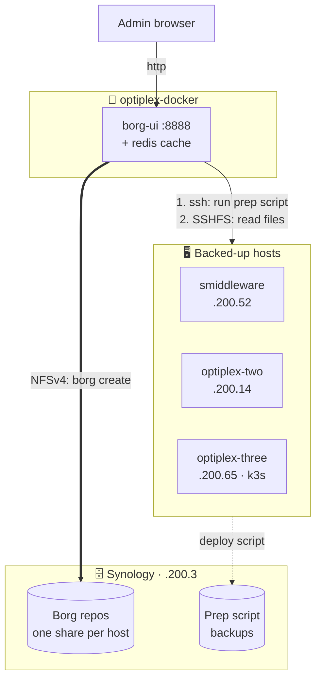
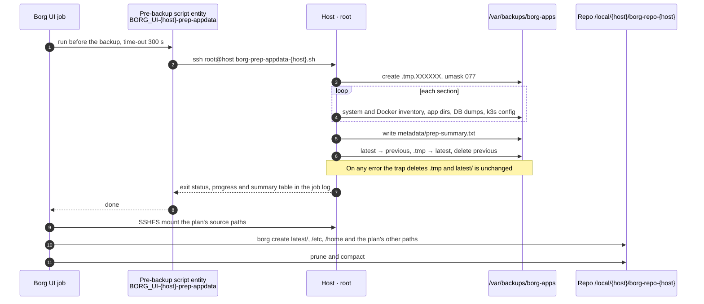
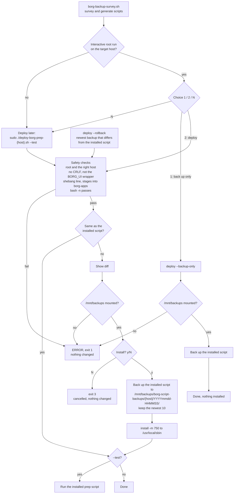
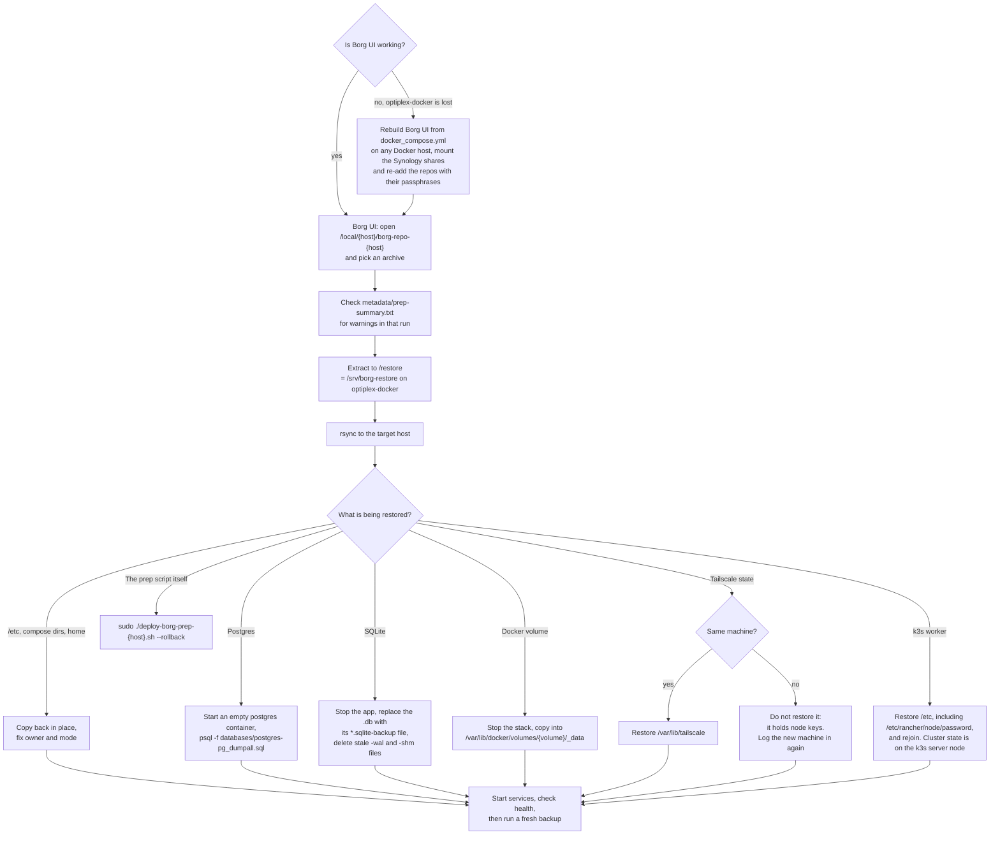

# Borg-Backup Application


This README documents only the borg-backup application in this folder, including its Docker Compose stack and local snapshot-prep scripts used by Borg.

## Architecture

### Infrastructure

Borg UI runs on optiplex-docker and pulls each host's data over SSH. The repositories live on
the Synology, one NFS share per backed-up host, mounted on optiplex-docker at
`/mnt/borg_<host>` and inside the container at `/local/<host>`. Each host stages its snapshot
in `/var/backups/borg-apps/latest` with `/usr/local/sbin/borg-prep-appdata-<host>.sh`. The
container's other mounts are listed under [Host Path Mounts](#host-path-mounts).



### Backup flow

What one host's backup plan does. The prep script builds the new snapshot in a temp directory,
so a failed run leaves the previous `latest/` in place.



### Prep script deploy and rollback

How a new or regenerated prep script reaches `/usr/local/sbin` on its host. All paths go through
`deploy-borg-prep-{host}.sh`, so the same checks apply to a survey deploy, a manual deploy and
a rollback.



### Restore flow

Restores go through the `/restore` staging area on optiplex-docker, never straight over live
data. Databases are restored from the dumps the prep script made, not from copied live files.



Without Borg UI, any Linux machine with `borg` installed can do the same: mount the host's
Synology share and run `borg list` / `borg extract` against `borg-repo-<host>`. The repos use
`repokey-blake2`, so the key is stored in the repo and only the passphrase is needed.

## Files

- `docker_compose.yml`: Runs `ainullcode/borg-ui` (plus a `redis` archive-cache sidecar) with required mounts, FUSE capabilities, and hardening (resource limits, healthchecks, log rotation).
- `BORG_UI-smiddleware-prep-appdata.sh`: Borg UI script-entity wrapper that triggers remote pre-backup app snapshot prep.
- `BORG_UI-borgui-config-export-snapshot.sh`: Borg UI script-entity wrapper that creates Borg UI local config export snapshots.
- `borg-prep-appdata-smiddleware.sh`: Builds a staged snapshot under `/var/backups/borg-apps/latest` on **smiddleware** (192.168.200.52) for Borg to back up.
- `borg-prep-appdata-optiplex-two.sh`: The same, for **optiplex-two** (192.168.200.14). Generated by `borg-backup-survey.sh` on 2026-08-01.
- `BORG_UI-optiplex-two-prep-appdata.sh`: Borg UI script-entity wrapper that triggers the optiplex-two prep script over SSH.
- `borg-prep-appdata-optiplex-three.sh`: The same, for **optiplex-three** (192.168.200.65, k3s worker). Generated by `borg-backup-survey.sh` on 2026-10-05.
- `deploy-borg-prep-optiplex-three.sh`: Installs the optiplex-three prep script into `/usr/local/sbin` with a backup, diff and safety checks.
- `BORG_UI-optiplex-three-prep-appdata.sh`: Borg UI script-entity wrapper that triggers the optiplex-three prep script over SSH.
- `pull-borg-scripts.sh`: Downloads a host's prep and deploy scripts, the survey script and this README from GitHub into `/home/thomas/borg-backup-scripts`, keeping a dated copy on the Synology share.
- `borg-backup-survey.sh`: Surveys an Ubuntu server (Docker, databases, non-Docker apps, Tailscale, Kubernetes, etc.), reports what Borg can back up, and optionally generates per-server versions of the two scripts above.

## Shell Script Reference

Scripts prefixed with `BORG_UI-` are referenced in Borg UI to create script entities. They are documented in this repo for versioning and auditing, then configured in the Borg UI Scripts section.

### `BORG_UI-smiddleware-prep-appdata.sh`

Purpose:

- Runs a remote pre-backup snapshot workflow on smiddleware before backup tasks continue.
- Calls `/usr/local/sbin/borg-prep-appdata-smiddleware.sh` over SSH on `root@192.168.200.52`.

Behavior:

- Uses non-interactive SSH (`BatchMode=yes`) and accepts new host keys automatically.
- Prints start/completion markers for job logs.

Borg UI script entity metadata (from header comments):

- Name: `smiddleware-prep-appdata`
- Description: Pre-backup app-data snapshot for smiddleware Docker services
- Run-on: Always (regardless of result)
- Time-out: 300 seconds (5 minutes)

Screenshot placeholder(s):

- `[Screenshot Placeholder: Borg UI script entity - smiddleware-prep-appdata configuration]`
- `[Screenshot Placeholder: Borg UI run history/output - smiddleware-prep-appdata]`

### `BORG_UI-optiplex-two-prep-appdata.sh`

Same pattern as the smiddleware wrapper: calls `/usr/local/sbin/borg-prep-appdata-optiplex-two.sh`
over SSH on `root@192.168.200.14`. Mirrors the Borg UI entity, which came from the
2026-07-03 survey run (the prep script in this repo is from the later 2026-08-01 run; the
wrapper body is identical between the two).

Borg UI script entity metadata:

- Name in Borg UI: `borg-prep-appdata-optiplex-two.sh` (the header comment suggests
  `optiplex-two-prep-appdata`; the entity was created under the prep script's filename instead)
- Description: Pre-backup app-data snapshot for optiplex-two services
- Run-on: Always (regardless of result)
- Time-out: 300 seconds (5 minutes)
- Used by: the optiplex-two backup plan (pre-backup)

### `BORG_UI-optiplex-three-prep-appdata.sh`

Same pattern as the smiddleware wrapper: calls `/usr/local/sbin/borg-prep-appdata-optiplex-three.sh`
over SSH on `root@192.168.200.65`, using Borg UI's System SSH Key.

Borg UI script entity metadata:

- Name: `optiplex-three-prep-appdata`
- Description: Pre-backup app-data snapshot for optiplex-three services
- Run-on: Always (regardless of result)
- Time-out: 300 seconds (5 minutes)
- Used by: the optiplex-three backup plan (pre-backup)

### `BORG_UI-borgui-config-export-snapshot.sh`

Purpose:

- Creates a local Borg UI configuration export snapshot before Borg UI self-backup.
- Captures key Borg UI state from `/data` and exports it to `/local/borgui-config-export` (mounted from the host at `/srv/borg-ui-config-export`, see [Host Path Mounts](#host-path-mounts)).

Behavior:

- Creates timestamped snapshots (`snapshot-YYYYmmdd-HHMMSS`) plus a refreshed `latest` copy.
- Uses SQLite backup API (via Python) to produce a consistent `borg.db` snapshot.
- Copies `.secret_key`, optional SSH keys, recent logs, and a lightweight file inventory.
- Retains the latest 14 snapshots and removes older ones.

Borg UI script entity metadata (from header comments):

- Name: `borgui-config-export-snapshot`
- Description: Creates regular Borg UI config export snapshot before Borg UI self-backup
- Run-on: Always (regardless of result)
- Time-out: 300 seconds (5 minutes)

Screenshot placeholder(s):

- `[Screenshot Placeholder: Borg UI script entity - borgui-config-export-snapshot configuration]`
- `[Screenshot Placeholder: Borg UI run history/output - borgui-config-export-snapshot]`

### Per-host prep scripts

There is one prep script per backed-up host. They share a structure — stage into a temp
directory, then atomically move it into `/var/backups/borg-apps/latest` — but each collects
a different set of apps, because each host runs different things.

> [!CAUTION]
> **The host name in the filename is load-bearing: deploying the wrong one silently backs up nothing.**

| Script | Host | Address | Deploy to |
| --- | --- | --- | --- |
| `borg-prep-appdata-smiddleware.sh` | smiddleware | 192.168.200.52 | `/usr/local/sbin/borg-prep-appdata-smiddleware.sh` |
| `borg-prep-appdata-optiplex-two.sh` | optiplex-two | 192.168.200.14 | `/usr/local/sbin/borg-prep-appdata-optiplex-two.sh` |
| `borg-prep-appdata-optiplex-three.sh` | optiplex-three | 192.168.200.65 | `/usr/local/sbin/borg-prep-appdata-optiplex-three.sh` |

#### `borg-prep-appdata-smiddleware.sh`

Behavior:

- Collects system metadata, package list, and Docker inventory.
- Collects config/data snapshots from AdGuard and Traefik under `/opt/netlab-stack`.
- Snapshots the Dashy user-data Docker volume.
- Performs SQLite-safe backup for the Portracker DB when present.
- Publishes the snapshot atomically by staging to a temp directory, then moving into `latest`.

Run manually with `sudo ./borg-prep-appdata-smiddleware.sh`.

#### `borg-prep-appdata-optiplex-two.sh`

Generated by `borg-backup-survey.sh` on 2026-08-01 from what was actually running on that
host at survey time. Behavior:

- Collects system metadata, package list, and Docker inventory.
- Snapshots the `statping` (`/data/compose/14`) and `portainer` (`/opt/docker/compose/portainer`) compose projects.
- Snapshots app data under `/volume1/docker/portracker`, with a SQLite-safe backup of `portracker.db`.
- Flushes Valkey/Redis persistence for `searxng-valkey`, and runs `pg_dumpall` against the `postgres` container.
- Captures Tailscale state and k3s datastore/config when present.
- Publishes the snapshot atomically by staging to a temp directory, then moving into `latest`.

> [!CAUTION]
> The Tailscale state **contains node keys — do not restore it onto a second machine.**

Run manually with `sudo ./borg-prep-appdata-optiplex-two.sh`.

#### `borg-prep-appdata-optiplex-three.sh`

Generated by `borg-backup-survey.sh` on 2026-10-05. optiplex-three is a **k3s worker
node** on a 29 GB eMMC with little local state, so the prep snapshot is small. Behavior:

- Collects system metadata, package list, and Docker inventory (only the `portainer-agent` compose project runs here).
- Copies `/etc/rancher/k3s` and k3s manifests when present. The datastore snapshot steps are
  no-ops on a worker — cluster state lives on the k3s server node, which must be backed up separately.
- Publishes the snapshot atomically by staging to a temp directory, then moving into `latest`.

The Borg UI plan for this host backs up `/var/backups/borg-apps/latest`, `/etc` (includes the
k3s node identity, `/etc/rancher/node/password`), `/home/thomas`, and
`/var/lib/rancher/k3s/storage` (local-path PV data; empty today, included so future PVs
scheduled onto this node are caught).

Each run prints timestamped progress, sends warnings to stderr, and ends with a summary table
(files, size and time per section, plus a warning count). The same summary is saved in the
snapshot as `metadata/prep-summary.txt`, so every archive carries it.

Run manually with `sudo /usr/local/sbin/borg-prep-appdata-optiplex-three.sh`.

Deploy or update it with `deploy-borg-prep-optiplex-three.sh`, run on optiplex-three with the
prep script in the same folder:

```bash
sudo ./deploy-borg-prep-optiplex-three.sh --test   # checks, diff, backup, install, test run
sudo ./deploy-borg-prep-optiplex-three.sh --list   # installed version + backups
sudo ./deploy-borg-prep-optiplex-three.sh --rollback      # newest backup that differs from the installed script
sudo ./deploy-borg-prep-optiplex-three.sh --backup-only   # back up the installed script, install nothing
```

It refuses the BORG_UI wrapper, CRLF line endings, syntax errors and the wrong host. Each backup
goes in its own date-time folder on the Synology share, and the last 10 are kept per host:

```text
/mnt/backups/borg-script-backups/optiplex-three/20261006-143000/borg-prep-appdata-optiplex-three.sh
```

> [!IMPORTANT]
> `/mnt/backups` must be mounted on the host being deployed. If it isn't, the deploy script
> installs, backs up and rolls back nothing. Backups from before this change stay in
> `/var/backups/borg-prep-scripts/` and are not used by `--rollback`.

### `borg-backup-survey.sh`

Purpose:

- Surveys a new Ubuntu server and reports what can be backed up by Borg, then optionally generates that server's custom `borg-prep-appdata-<name>.sh` and `BORG_UI-<name>-prep-appdata.sh`.

What it inspects:

- System identity, disks, packages, cron jobs
- Docker: containers (Compose-managed and standalone `docker run` containers), images, volumes, networks, Compose projects, bind-mounted app data dirs (with sizes)
- Databases in containers (Postgres, MySQL/MariaDB, MongoDB, Redis, InfluxDB, Elasticsearch, ...) and SQLite files in app dirs
- Applications outside Docker via systemd (web servers, databases, media servers, monitoring, DNS/DHCP, VPN, ...)
- Tailscale state, Kubernetes (k3s / microk8s / kubeadm), LXD, libvirt/KVM, ZFS

Usage (run on the target server):

```bash
sudo ./borg-backup-survey.sh                 # survey + report, then prompt to generate scripts
sudo ./borg-backup-survey.sh --report-only   # report only
sudo ./borg-backup-survey.sh --generate --name myserver --address 192.168.200.60
sudo ./borg-backup-survey.sh --from ./borg-survey-myserver-20260703-110322   # regenerate scripts from a previous survey's raw data (no re-survey)
```

Each survey saves its collected state to `raw/survey-state.sh`. On the next interactive run, if a previous survey directory for the host is found, the script asks whether to re-run the survey or reuse the existing raw data to generate the scripts (`--from DIR` does the same non-interactively).

After generating scripts in an interactive root session on the target host, the survey asks what to do with the installed prep script:

```text
  1) Back up the installed script only
  2) Back up the installed script and deploy the new one (shows a diff and asks first)
  N) Nothing
```

Both options run the generated `deploy-borg-prep-<name>.sh`, so its safety checks and diff apply.
If the deploy script fails (a refused file, the wrong host), the survey exits with its error code;
answering N at the deploy script's own y/N prompt (exit 3) counts as a cancel, not a failure.

`--name` and `--address` must be plain hostnames or IP addresses, because they are written into the
generated scripts; anything else is refused before the survey starts.

Output (in `./borg-survey-<name>-<timestamp>/`):

- `REPORT.md` — what was found, what Borg should back up, consistency caveats, suggested excludes
- `raw/` — raw inventory data backing the report
- `borg-prep-appdata-<name>.sh` — generated prep script following the same staged/atomic-publish pattern as the existing per-host scripts, with DB-safe dumps (pg_dumpall, mysqldump, mongodump, SQLite `.backup`, k3s etcd-snapshot) for everything detected
- `BORG_UI-<name>-prep-appdata.sh` — generated Borg UI script-entity wrapper (SSH trigger)
- `deploy-borg-prep-<name>.sh` — installs the prep script to `/usr/local/sbin`: backs up the old version, shows a diff, refuses the wrapper/CRLF/wrong host; `--test`, `--rollback`, `--list`, `--backup-only`

> [!IMPORTANT]
> The generated scripts are starting points reflecting what was detected at survey time — review rsync sources, database credentials, and any commented-out large directories before deploying to `/usr/local/sbin/`.

### `pull-borg-scripts.sh`

Gets the current scripts onto a host from GitHub, so they arrive with Linux line endings (copies
made on Windows have CRLF endings, which the deploy script refuses). It downloads four files from
`borg-backup/` and installs nothing:

- `borg-prep-appdata-<host>.sh` and `deploy-borg-prep-<host>.sh`
- `borg-backup-survey.sh` and `README.md`

The Borg UI wrapper is not pulled: it belongs in the Borg UI script entity, not on the host.

First time, on the host:

```bash
mkdir -p ~/borg-backup-scripts && cd ~/borg-backup-scripts
curl -fsSLO https://raw.githubusercontent.com/BladerunnerxRC/Docker/main/borg-backup/pull-borg-scripts.sh
chmod 750 pull-borg-scripts.sh
sudo ./pull-borg-scripts.sh                 # this host's files from main
```

After that:

```bash
sudo ~/borg-backup-scripts/pull-borg-scripts.sh [--branch BRANCH] [--name HOST]
cd ~/borg-backup-scripts && sudo ./deploy-borg-prep-<host>.sh --test
```

- All four files are downloaded and checked (not empty, no CRLF, `#!` line, `bash -n`) before
  anything is written. A missing file, or `/mnt/backups` not being mounted, stops it with nothing changed.
- Each pull is copied to `/mnt/backups/borg-script-backups/<host>/github-pulls/<YYYYmmdd-HHMMSS>/`
  with a `SOURCE.txt` recording the branch and commit. The newest 10 are kept. These copies are
  separate from the deploy script's backups, and `--rollback` does not use them.
- Files in `~/borg-backup-scripts` are owned by the folder's owner (thomas), not root: scripts
  `750`, README `640`. The deploy script installs to `/usr/local/sbin` as `root:root 750`.
- It prints each file as `new`, `updated` or `unchanged`.

## What This Stack Does

- Provides a web UI (`borg-ui`) for running and managing Borg backups.
- Uses a `redis` sidecar as an archive cache so Borg UI can browse large repositories' archive lists/contents faster.
- Mounts one or more Borg repositories into the container under `/local/*`, plus a dedicated restore-staging path.
- Exposes a config export path so Borg UI's own database/secrets/SSH keys can be snapshotted and picked up by Borg like any other app data.
- Mounts backup source data as read-only paths.
- Separately prepares a consistent app-data snapshot (metadata, Docker inventory, app config/data) before backup runs.
- Is watched by `wud` (What's Up Docker) for new image versions/digests via container labels.

## Service Details

- Service name: `borg-ui`
- Container name: `borg-backup`
- Image: `ainullcode/borg-ui:latest`
- Host port: `8888`
- Container port: `8081`

Open the UI at:

- `http://<host-ip>:8888`

### Redis sidecar

- Service name: `redis`
- Container name: `borg-redis`
- Image: `redis:7-alpine`
- Purpose: archive cache for `borg-ui` (faster archive browsing), not exposed on a host port.
- Persistence: AOF enabled (`--appendonly yes`), capped at `512mb` with `allkeys-lru` eviction, backed by the `borgui_redis` named volume.
- `borg-ui` has `depends_on: redis (condition: service_healthy)`, so it won't start until Redis passes its `redis-cli ping` healthcheck.

## Environment Variables

- `TZ`: Container timezone (`America/New_York`).
- `PORT`: Internal port Borg UI listens on (`8081`).
- `PUID` / `PGID`: User/group ID Borg UI runs as (`1024` / `100`).
- `LOCAL_MOUNT_POINTS`: Comma-separated list of in-container paths Borg UI treats as local repo/restore locations (`/local,/restore`).
- `REDIS_HOST` / `REDIS_PORT`: Connection info for the `redis` archive-cache sidecar (`redis` / `6379`).

## Host Path Mounts

The compose file currently uses these host paths:

| Host path | Container path | Mode | Purpose |
| --- | --- | --- | --- |
| `/srv/borg-source` | `/source/data` |  | Backup source data |
| `/opt/borg-ui-empty` | `/source/empty` |  | Empty placeholder source |
| `/mnt/backups/borgrepo` | `/local/shared` |  | Optiplex Borg repo |
| `/mnt/borg_smiddleware` | `/local/smiddleware` |  | Smiddleware Borg repo |
| `/mnt/borg_optiplex-two` | `/local/optiplex-two` |  | optiplex-two Borg repo |
| `/mnt/borg_optiplex-three` | `/local/optiplex-three` |  | optiplex-three Borg repo |
| `/srv/borg-restore` | `/restore` |  | Restore staging area |
| `/var/log/borg` | `/logs` |  | Borg job logs |
| `/srv/borg-ui-config-export` | `/local/borgui-config-export` |  | Borg UI config export snapshots (see `BORG_UI-borgui-config-export-snapshot.sh`) |

Named volumes:

- `borgui_data:/data` — Borg UI application state/database (also bind-mounted read-only into the container itself at `/local/borgui-data`, e.g. for inspection/export workflows).
- `borgui_cache:/home/borg/.cache/borg` — Borg's own archive/chunk cache.
- `borgui_redis:/data` (on the `redis` service) — Redis AOF persistence for the archive cache.

The `/mnt/backups` and `/mnt/borg_<host>` paths are NFSv4 shares from the Synology
(`192.168.200.3:/volume1/SYSBAK_borgrepos_<host>`), one per backed-up host, mounted via
`/etc/fstab` on the Borg UI host (optiplex-docker) with `x-systemd.automount`. The live stack
is deployed from Portainer, so mount changes go in the Portainer stack editor as well as here.

> [!TIP]
> If your host paths differ, edit `docker_compose.yml` before first start.

## Prerequisites

- Docker Engine with Compose plugin
- Host paths above created with proper ownership/permissions
- FUSE available on host (`/dev/fuse`)
- AppArmor policy allowing this container setup (`apparmor:unconfined` is configured)

## Start and Stop

Start in detached mode:

```bash
docker compose -f docker_compose.yml up -d
```

Check status:

```bash
docker compose -f docker_compose.yml ps
```

Follow logs:

```bash
docker compose -f docker_compose.yml logs -f borg-ui
```

Stop:

```bash
docker compose -f docker_compose.yml down
```

## App Snapshot Prep Script

> [!IMPORTANT]
> Run the prep script **for that host** before its Borg backup job, so Borg reads a stable
> snapshot:

```bash
sudo ./borg-prep-appdata-smiddleware.sh    # on smiddleware
sudo ./borg-prep-appdata-optiplex-two.sh   # on optiplex-two
sudo ./borg-prep-appdata-optiplex-three.sh # on optiplex-three
```

Expected output location (both hosts):

- `/var/backups/borg-apps/latest`

See [Per-host prep scripts](#per-host-prep-scripts) for what each one collects. Both publish
snapshots atomically by staging in a temp directory, then moving into `latest`.

## Scheduling Example

Example cron flow:

1. Run the host's `borg-prep-appdata-<host>.sh`
2. Run `borg create ... /var/backups/borg-apps/latest`
3. Run prune/compact policies

## Reliability and Operations Notes

- `borg-ui` has a 120s `stop_grace_period` so in-flight `borg create`/`compact`/`prune` operations get a chance to finish cleanly on stop/restart instead of being killed mid-operation.
- `borg-ui` and `redis` both set `mem_limit`/`pids_limit` (and `borg-ui` also sets `cpus`) to protect the host from runaway compaction/extraction jobs.
- Both services use a `json-file` logging driver capped at 10MB × 3 files to avoid unbounded log growth.
- `borg-ui` has a lightweight healthcheck (TCP connect to its own port via Python) so `restart: unless-stopped` and external monitoring can detect a wedged UI.
- `wud` labels on `borg-ui` opt it into image-update tracking (tag + digest) without auto-updating it.

## Security Notes

> [!CAUTION]
> This container uses elevated settings (`/dev/fuse`, `SYS_ADMIN`, AppArmor unconfined). Restrict host access accordingly.

- `SYS_ADMIN` is required for FUSE-based repo mounting/browsing; the container's entrypoint also needs full default capabilities at startup (running as root) to `chown`/prepare `/home/borg` before dropping to the `PUID`/`PGID` user, so capabilities are not further restricted with `cap_drop`.
- Borg repositories contain sensitive data. Protect `/mnt/backups/borgrepo` and the `/mnt/borg_<host>` shares with strict filesystem/NFS permissions.
- The config export path (`/srv/borg-ui-config-export`) contains Borg UI's database, secret key, and SSH keys — treat it with the same care as the repos themselves.
- Keep backup logs and snapshot output directories readable only by trusted users.

## Troubleshooting

- UI not reachable:
  - Confirm port mapping with `docker compose -f docker_compose.yml ps`.
  - Check host firewall for port `8888`.
  - Check the `borg-ui` healthcheck status (`docker compose -f docker_compose.yml ps` shows `healthy`/`unhealthy`).
- `borg-ui` won't start / stuck waiting:
  - It depends on `redis` being healthy first — check `docker compose -f docker_compose.yml logs redis`.
- `mkdir: cannot create directory '/home/borg': Permission denied` on startup:
  - The entrypoint needs its full default capability set (running as root) to prepare `/home/borg` before dropping to the configured `PUID`/`PGID`. Don't add `cap_drop: ALL` to this service.
- Backup source or repo path errors:
  - Validate host directories exist and are mounted as expected.
- Snapshot script failures:
  - Run as root.
  - Ensure `docker`, `rsync`, and `sqlite3` are installed.
  - Check permissions on `/var/backups/borg-apps` and source paths.
